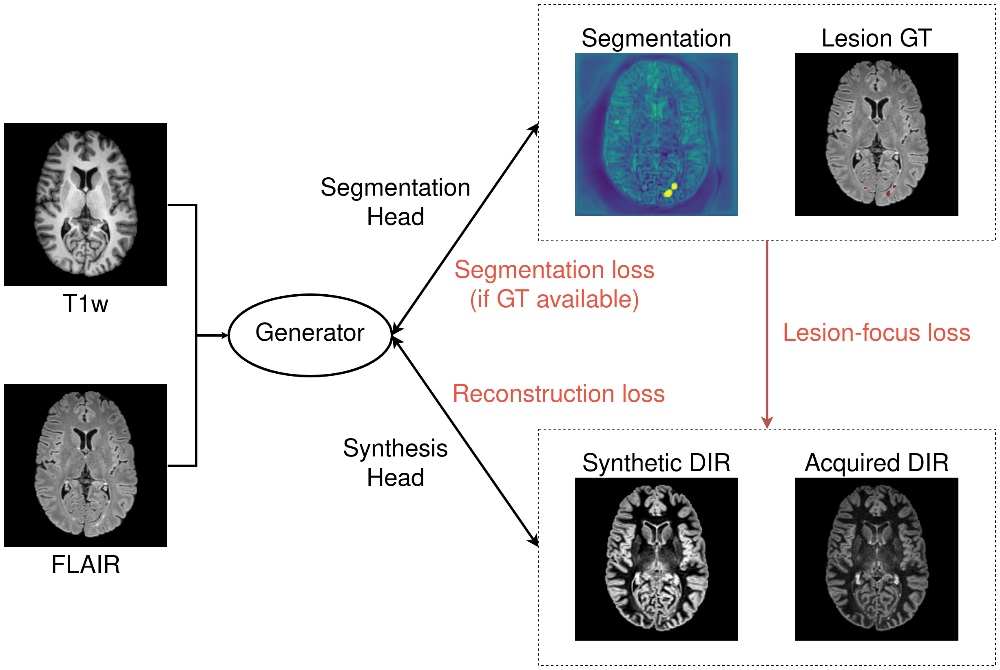

# SynthSegNet
This repository provides code for training a joint segmentation and synthesis network for MS lesion segmentation and synthetic DIR (**D**ouble **I**nversion **R**ecovery).
Our framework is rather generic and can be adapted to different diseases, body parts and modalities.

Data format
-----------
For our example code to work, image data are supposed to be
- Co-registered per scan into [MNI152 space](http://www.bic.mni.mcgill.ca/ServicesAtlases/ICBM152NLin2009)
- Skull-stripped
- File names should contain "_flair", "_t1", "_dir" and "_seg", respectively:
  > patient_01
  >  > patient_01_flair.nii.gz
  
  >  > patient_01_t1.nii.gz
  
  >  > patient_01_dir.nii.gz
  
  >  > patient_01_seg.nii.gz
